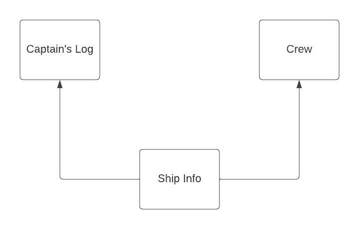
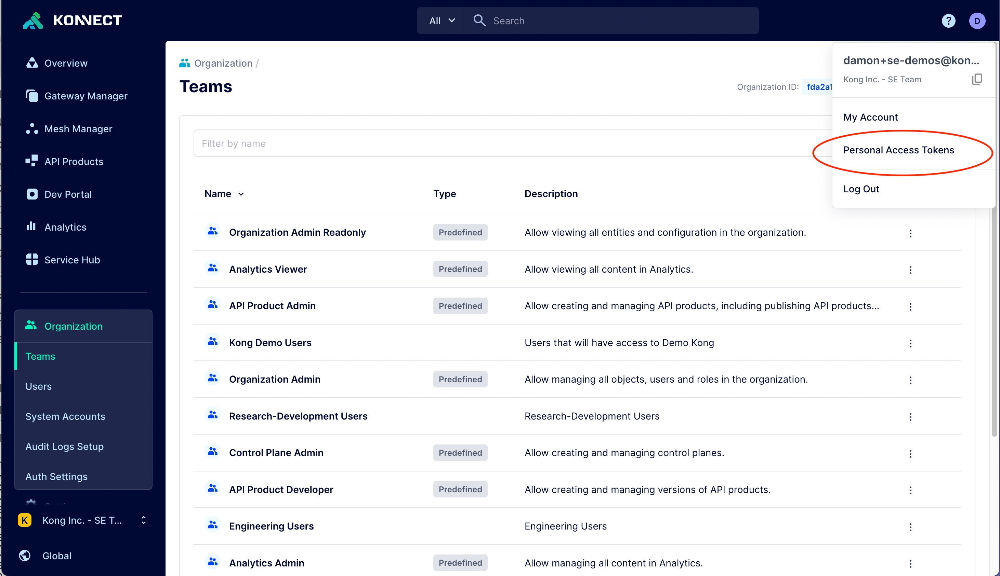
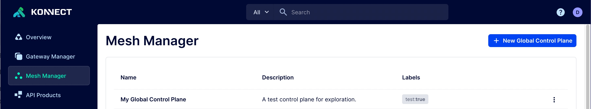
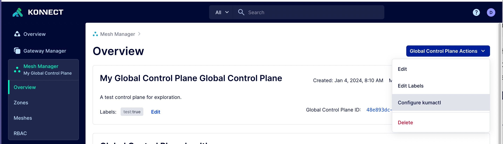
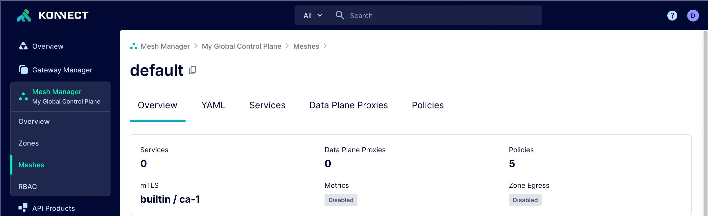
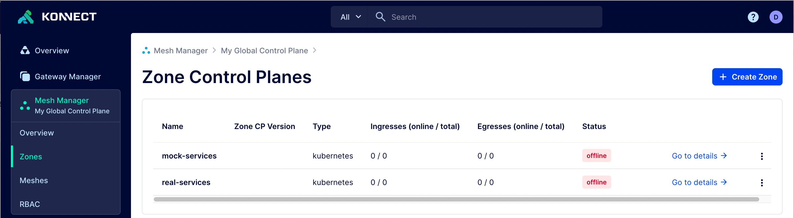
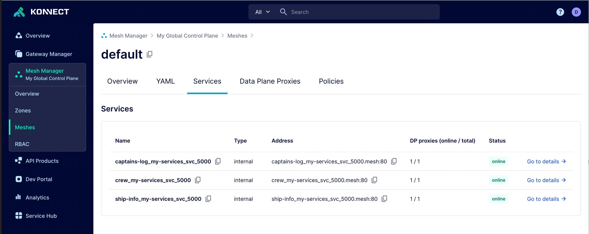
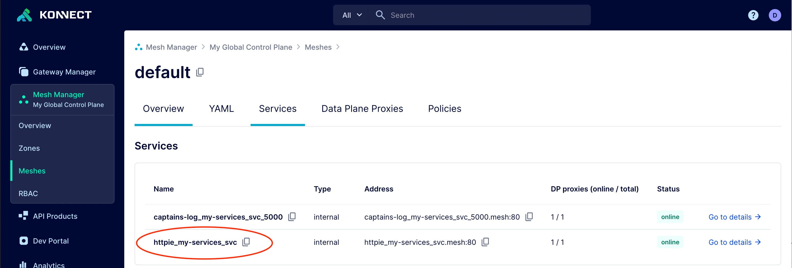
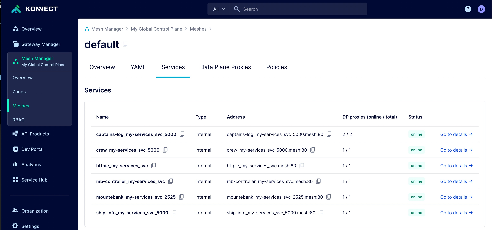
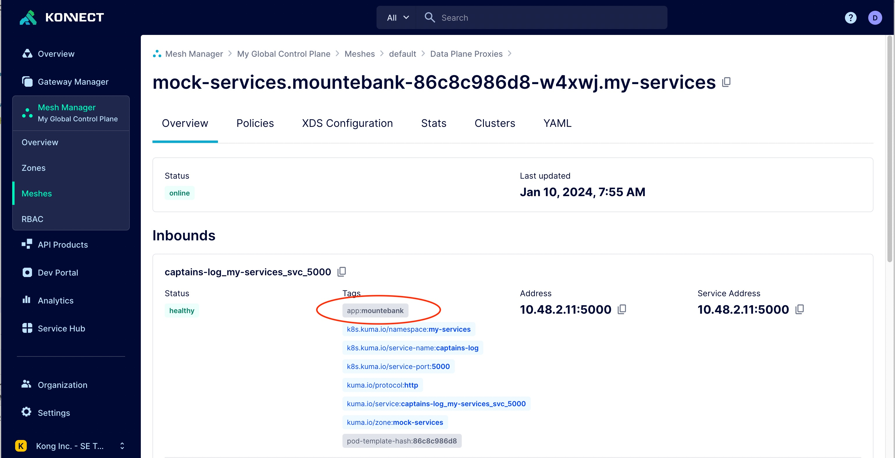

# Enterprise Performance Testing with Service Mesh

Having a solid mocking foundation for the enterprise is crucial for building reliable and performant software that is continuously developed in a micro-service architecture. When doing performance testing, it is often necessary to replace actual services with mock services in order to isolate the services being tested. By using mocked services, you can measure the performance for certain flows within your systems without unnecessary noise. In this tutorial, I am going to show you how to seamlessly integrate mocking services available on demand into your application landscape using a service mesh. By applying simple service mesh policies, developers can switch between mocked services and real services with ease.

##### Prerequisites:
* Free trial Kong Konnect account. You can sign up [here](https://konghq.com/products/kong-konnect/register)
* Two Kubernetes clusters (one for real services and one for mocked services)
* [Clone git repository](https://github.com/Kong/blog-mocking)
* [kubectl](https://kubernetes.io/docs/tasks/tools/)
* [helm](http://helm.sh)
* [kumactl](https://docs.konghq.com/mesh/2.5.x/production/install-kumactl/)
* [httpie](https://httpie.io/) (or some other command line HTTP client)


_Note: Because we are communicating from cluster to cluster, it is important that you are able to create services of type LoadBalanced inside your Kubernetes clusters._

##### Summary

In order to create on-demand testing services, we will need the ability to switch from real services to mocked services during performance testing at run time. As it turns out, a service mesh is the perfect tool to accomplish this task. By routing traffic at layer 4, you can redirect traffic without changing any application configuration. In this tutorial, we are going to use [Kong Mesh](https://docs.konghq.com/konnect/mesh-manager/) running in Konnect as our service mesh implemention combined with the [TrafficRoute](https://docs.konghq.com/mesh/latest/policies/traffic-route/#main) policy. We will be running a [multizone](https://docs.konghq.com/mesh/2.5.x/production/deployment/multi-zone/) deployment for our service mesh, which allows for workloads running in different regions, on different clouds, or in different datacenters. For our mocking framework, we will be using [Mountebank](http://mbtest.org).

In this tutorial, we will be using three micro-services. We will have two backend services that provide data, and one frontend api that calls the backend services.



##### Login to Konnect and create a Personal Access Token

When you are ready to begin, log into your trial Kong Konnect accoun and can create a personal access token, which will be used to make API calls to configure our service mesh. See below screen shot.



Once you have your PAT, the next thing we need to do is create a global control plane. We can do this using an API. Inside a terminal, change to your cloned git project and run the below commands.

##### Setup Kong Mesh Global Control Plane
```
BASE_URL=https://us.api.konghq.com
KONNECT_TOKEN=your-token
http POST $BASE_URL/v1/mesh/control-planes Authorization:$KONNECT_TOKEN < gcp.json
```

```
# sample output
{
    "created_at": "2024-01-04T14:10:14.190310907Z",
    "description": "A test control plane for exploration.",
    "id": "48e893dc-6a4e-40fb-a933-d06e92cccce6",
    "labels": {
        "test": "true"
    },
    "name": "My Global Control Plane",
    "updated_at": "2024-01-04T14:10:14.190311007Z"
}
```
Save the Global Control Plane id to an environment variable.
```
GCP_ID=<id from command output>
```

Now, when you navigate to Mesh Manager in your Konnect account and you should be able to see your newly created Global Control Plane.



##### Configure kumactl and enable mTLS

Next, we must configure `kumactl` to talk to our Global Control Plane. From the Mesh Manager, click into your GCP and configure kumactl. See below.



Test your `kumactl` configuration:

```
kumactl get meshes
```

```
# output
NAME      mTLS   METRICS   LOGGING   TRACING   LOCALITY   ZONEEGRESS   AGE
default   off    off       off       off       off        off          43s
```

Now that `kumactl` is configured, run the below command. The below command will enable Kong Mesh's built-in [mTLS provider](https://docs.konghq.com/mesh/latest/policies/mutual-tls/#usage-of-builtin-ca), which is required for doing multi-zone service mesh.

```
kumactl apply -f default-mesh.yaml
kumactl get meshes
```

```
NAME      mTLS           METRICS   LOGGING   TRACING   LOCALITY   ZONEEGRESS   AGE
default   builtin/ca-1   off       off       off       off        off          2s
```

From the Mesh Manager, click on Meshes and go into the "default" mesh, and you should see the following.



##### Provision Zone Control Planes

Next, we need to provision two zones that connect to our global control plane, one for actual services and the other for mock responses and testing. These zone control planes will run in your two Kubernetes clusters.

First, we will provision the zone that contain the "real" services.

```
# this will return the id of the newly created zone control plane
http POST $BASE_URL/v0/mesh/control-planes/$GCP_ID/api/provision-zone name="real-services" Authorization:$KONNECT_TOKEN
```

```
# sample output
{
    "token": "xyz"
}
```

Save the token to an environment variable.
```
REAL_SERVICES_TOKEN=<paste token here>
```

Next, we will provision our mocked service zone.

```
http POST $BASE_URL/v0/mesh/control-planes/$GCP_ID/api/provision-zone name="mock-services" Authorization:$KONNECT_TOKEN
```

```
# sample output
{
    "token": "xyz"
}
```

Save the token to an environment variable.
```
MOCK_SERVICES_TOKEN=<paste token here>
```

Check your Mesh Manager and you should see two offline zones:



##### Deploy Kong Mesh

After your zones are provisioned, we need to deploy Kong Mesh to each of your clusters.

Switch to real services Kubernetes context.
```
kubectl create ns kong-mesh-system
helm repo add kong-mesh https://kong.github.io/kong-mesh-charts
helm repo update

kubectl create secret generic cp-token --from-literal=token=$REAL_SERVICES_TOKEN -n kong-mesh-system

helm upgrade --install kong-mesh kong-mesh/kong-mesh -n kong-mesh-system \
--set kuma.controlPlane.tls.kdsZoneClient.skipVerify=true \
--set kuma.controlPlane.zone=real-services \
--set kuma.controlPlane.konnect.cpId=$GCP_ID \
--values values-remote-konnect.yaml
```

Once the helm command finishes, switch to mocking services context.
```
kubectl create ns kong-mesh-system

kubectl create secret generic cp-token --from-literal=token=$MOCK_SERVICES_TOKEN -n kong-mesh-system

helm upgrade --install kong-mesh kong-mesh/kong-mesh -n kong-mesh-system \
--set kuma.controlPlane.tls.kdsZoneClient.skipVerify=true \
--set kuma.controlPlane.zone=mock-services \
--set kuma.controlPlane.konnect.cpId=$GCP_ID \
--values values-remote-konnect.yaml
```

When the zone control planes have completed deploying, you should see the following in your Mesh Manager under Zones.


##### Deploy services

Now, we are going to deploy the workloads which will appear as services on the mesh.

Switch back to the real services Kubernetes context and deploy our Captain's Log service.

```
NAMESPACE=my-services
kubectl create ns $NAMESPACE
kubectl label ns $NAMESPACE kuma.io/sidecar-injection=enabled
kubectl apply -f deployment-captains-log.yaml -n $NAMESPACE
kubectl apply -f deployment-crew.yaml -n $NAMESPACE
kubectl apply -f deployment-ship-info.yaml -n $NAMESPACE
```

From Mesh Manager, go into the default mesh. On the Services tab, you should see our newly created services. It may take a few seconds for them to come online.



Let's test our service to see if works. We will install a httpie pod.

```
kubectl apply -f httpie.yaml -n $NAMESPACE
```
Once the httpie services is online in the mesh, open a shell on the newly created httpie pod and execute the following command.



```
kubectl exec -it pod/httpie -n $NAMESPACE -- http http://captains-log_my-services_svc_5000.mesh
```

```
HTTP/1.1 200 OK
content-length: 1188
content-type: application/json
date: Tue, 09 Jan 2024 13:47:28 GMT
server: envoy
x-envoy-upstream-service-time: 6

{
    "entries": [
        {
            "crewMemberId": "111-11-1111",
            "rank": "captain",
            "ship_id": "NCC-1701",
            "stardate": "98398.64",
            "title": "Kong Mesh Traffic Permissions",
            "transcript": "Started using traffic permission policy in Kong Mesh today"
        },
        {
            "crewMemberId": "111-11-1112",
            "rank": "captain",
            "ship_id": "NCC-1764",
            "stardate": "98399.12",
            "title": "Kong Mesh  Traffic Routing",
            "transcript": "Started using traffic routing policy in Kong Mesh today"
        },
        {
            "crewMemberId": "111-11-1113",
            "rank": "captain",
            "ship_id": "NCC-1031",
            "stardate": "98355.61",
            "title": "Kong Mesh OPA",
            "transcript": "Started using OPA policy in Kong Mesh today"
        },
        {
            "crewMemberId": "111-11-1114",
            "rank": "captain",
            "ship_id": "NCC-1864",
            "stardate": "98344.64",
            "title": "Kong Mesh RBAC",
            "transcript": "Started using RBAC in Kong Mesh today"
        }
    ]
}
```

Test the crew service.

```
kubectl exec -it pod/httpie -n $NAMESPACE -- http http://crew_my-services_svc_5000.mesh
```

```
HTTP/1.1 200 OK
content-length: 513
content-type: application/json
date: Thu, 11 Jan 2024 15:26:58 GMT
server: envoy
x-envoy-upstream-service-time: 12

{
    "entries": [
        {
            "id": "111-11-1113",
            "name": "Christopher Pike",
            "rank": "captain"
        },
        {
            "id": "111-11-1111",
            "name": "James T. Kirk",
            "rank": "captain"
        },
        {
            "id": "111-11-1112",
            "name": "Jean Luc Picard",
            "rank": "captain"
        },
        {
            "id": "111-11-1114",
            "name": "Red Shirt Guy",
            "rank": "ensign"
        }
    ]
}
```

Test the Ship Info service.

```
kubectl exec -it pod/httpie -n $NAMESPACE -- http http://ship-info_my-services_svc_5000.mesh
```
```
HTTP/1.1 200 OK
content-length: 504
content-type: application/json
date: Thu, 11 Jan 2024 16:40:55 GMT
server: envoy
x-envoy-upstream-service-time: 78

{
    "captainsLog": {
        "entries": [
            {
                "crewMemberId": "111-11-1111",
                "rank": "captain",
                "ship_id": "NCC-1701",
                "stardate": "98398.64",
                "title": "Kong Mesh Traffic Permissions",
                "transcript": "Started using traffic permission policy in Kong Mesh today"
            }
        ]
    },
    "crew": {
        "entries": [
            {
                "id": "111-11-1113",
                "name": "Christopher Pike",
                "rank": "captain"
            },
            {
                "id": "111-11-1111",
                "name": "James T. Kirk",
                "rank": "captain"
            },
            {
                "id": "111-11-1112",
                "name": "Jean Luc Picard",
                "rank": "captain"
            },
            {
                "id": "111-11-1114",
                "name": "Red Shirt Guy",
                "rank": "ensign"
            }
        ]
    }
}
```

##### Add delay to the Captain's Log service

Now that we have all of our services stood up, let's use the service mesh to add some realism to our scenario. In our performance testing we want to mock the Captain's Log service and only measure the time it takes to call the Crew service. So, by using the [FaultInjection policy](https://docs.konghq.com/mesh/latest/policies/fault-injection/), we can add latency at the data plane proxy, in turn, creating the realism. The below policy tells the service mesh that for all services, delay the Captain's Log responses for 1 second.

```
type: FaultInjection
mesh: default
name: delay-captains-log
sources:
 - match:
     kuma.io/service: '*'
destinations:
 - match:
     kuma.io/service: captains-log_my-services_svc_5000
     kuma.io/protocol: http
     app: captains-log
conf:
 delay:
   percentage: 100
   value: 1s
```

Apply policy:
```
kumactl apply -f delay-captains-log.yaml
```

Since we have two Captain's Log service data plane proxies, we need to add a service mesh policy that only routes traffic to the real service instead of load balancing between the real service and mock service.

```
type: TrafficRoute
name: captains-log-real-route
mesh: default
sources:
- match:
    kuma.io/service: httpie_my-services_svc
destinations:
- match:
    kuma.io/service: captains-log_my-services_svc_5000
conf:
  split:
    - weight: 100
      destination:
        kuma.io/service: captains-log_my-services_svc_5000
        app: captains-log
```

Apply policy:
```
kumactl apply -f real-route.yaml
```

Wait a few seconds for the Global Control Plane to propagate your policy. You should see the service now taking ~1 second to complete, e.g. `x-envoy-upstream-service-time: 1006`.

```
kubectl exec -it pod/httpie -n $NAMESPACE -- http http://captains-log_my-services_svc_5000.mesh
```

```
HTTP/1.1 200 OK
content-length: 1188
content-type: application/json
date: Fri, 12 Jan 2024 14:12:46 GMT
server: envoy
x-envoy-upstream-service-time: 1006

{
    "entries": [
        {
            "crewMemberId": "111-11-1111",
            "rank": "captain",
            "ship_id": "NCC-1701",
            "stardate": "98398.64",
            "title": "Kong Mesh Traffic Permissions",
            "transcript": "Started using traffic permission policy in Kong Mesh today"
        },
        {
            "crewMemberId": "111-11-1112",
            "rank": "captain",
            "ship_id": "NCC-1764",
            "stardate": "98399.12",
            "title": "Kong Mesh  Traffic Routing",
            "transcript": "Started using traffic routing policy in Kong Mesh today"
        },
        {
            "crewMemberId": "111-11-1113",
            "rank": "captain",
            "ship_id": "NCC-1031",
            "stardate": "98355.61",
            "title": "Kong Mesh OPA",
            "transcript": "Started using OPA policy in Kong Mesh today"
        },
        {
            "crewMemberId": "111-11-1114",
            "rank": "captain",
            "ship_id": "NCC-1864",
            "stardate": "98344.64",
            "title": "Kong Mesh RBAC",
            "transcript": "Started using RBAC in Kong Mesh today"
        }
    ]
}
```
##### Deploy mocking framework

Next, we are going to deploy the mocking framework, so we can mock the Captain's Log service. Switch back to the mocking services Kubernetes context and deploy the mocking framework.

```
kubectl create ns $NAMESPACE
kubectl label ns $NAMESPACE kuma.io/sidecar-injection=enabled
kubectl apply -f deployment-mountebank.yaml -n $NAMESPACE
kubectl apply -f deployment-mb-operator.yaml -n $NAMESPACE
kubectl apply -f imposter-config.yaml -n $NAMESPACE
kubectl apply -f imposter-service.yaml -n $NAMESPACE
```

Once everything is deployed, your default mesh should now look something like this:



Let test our mock service. Apply `httpie.yaml`

```
kubectl apply -f httpie.yaml -n $NAMESPACE
```

We must delete our traffic route we created earlier that routes all traffic to the real service.

```
kumactl delete traffic-route captains-log-real-route
```

Execute the following command until you see the mocked response. It may take a few tries to get the mocked response.

```
kubectl exec -it pod/httpie -n $NAMESPACE -- http http://captains-log_my-services_svc_5000.mesh
```

```
HTTP/1.1 200 OK
content-type: application/json
date: Tue, 09 Jan 2024 17:58:06 GMT
server: envoy
transfer-encoding: chunked
x-envoy-upstream-service-time: 9
x-mocked: true

{
    "entries": [
        {
            "crewMemberId": "111-11-1111",
            "rank": "captain",
            "ship_id": "NCC-1701",
            "stardate": "98398.64",
            "title": "Kong Mesh Traffic Permissions",
            "transcript": "Started using traffic permission policy in Kong Mesh today"
        }
    ]
}
```

Notice the `x-mocked: true` header. This indicates the response is coming from our mocked service instead of the real one. You should see alernating responses from the real service and the mocked service. In order for us to isolate the mocked captain's log service, we need to apply a simple traffic routing policy that redirects 100% of the traffic.

##### Apply traffic routing policy

The below "TrafficRoute" policy tells all requests that come from the `httpie_my-services_svc` with a destination of `captains-log_my-services_svc_5000` to redirect 100% of the traffic the `captains-log_my-services_svc_5000` tagged with `app: mountebank`. Kong Mesh allows you to use custom tags for policy criteria. See [documentation](https://docs.konghq.com/mesh/latest/production/dp-config/dpp/#tags) for more information.

```
type: TrafficRoute
name: captains-log-imposter-route
mesh: default
sources:
- match:
    kuma.io/service: httpie_my-services_svc
destinations:
- match:
    kuma.io/service: captains-log_my-services_svc_5000
conf:
  split:
    - weight: 100
      destination:
        kuma.io/service: captains-log_my-services_svc_5000
        app: mountebank
```



Apply the policy to your global control plane:

```
kumactl apply -f imposter-route.yaml
```

##### Test your policy

Now execute the following command a few times, and you will see all responses from the mocked captain's log service only. You are now free to performance test your criticial path without the 1 second response time of the real Captain's Log service, e.g. `x-envoy-upstream-service-time: 59`.

```
kubectl exec -it pod/httpie -n $NAMESPACE -- http http://ship-info_my-services_svc_5000.mesh
```

```
HTTP/1.1 200 OK
content-length: 1046
content-type: application/json
date: Fri, 12 Jan 2024 14:19:45 GMT
server: envoy
x-envoy-upstream-service-time: 59

{
    "captainsLog": {
        "entries": [
            {
                "crewMemberId": "111-11-1111",
                "rank": "captain",
                "ship_id": "NCC-1701",
                "stardate": "98398.64",
                "title": "Kong Mesh Traffic Permissions",
                "transcript": "Started using traffic permission policy in Kong Mesh today"
            },
            {
                "crewMemberId": "111-11-1112",
                "rank": "captain",
                "ship_id": "NCC-1764",
                "stardate": "98399.12",
                "title": "Kong Mesh  Traffic Routing",
                "transcript": "Started using traffic routing policy in Kong Mesh today"
            },
            {
                "crewMemberId": "111-11-1113",
                "rank": "captain",
                "ship_id": "NCC-1031",
                "stardate": "98355.61",
                "title": "Kong Mesh OPA",
                "transcript": "Started using OPA policy in Kong Mesh today"
            },
            {
                "crewMemberId": "111-11-1114",
                "rank": "captain",
                "ship_id": "NCC-1864",
                "stardate": "98344.64",
                "title": "Kong Mesh RBAC",
                "transcript": "Started using RBAC in Kong Mesh today"
            }
        ]
    },
    "crew": {
        "entries": [
            {
                "id": "111-11-1113",
                "name": "Christopher Pike",
                "rank": "captain"
            },
            {
                "id": "111-11-1111",
                "name": "James T. Kirk",
                "rank": "captain"
            },
            {
                "id": "111-11-1112",
                "name": "Jean Luc Picard",
                "rank": "captain"
            },
            {
                "id": "111-11-1114",
                "name": "Red Shirt Guy",
                "rank": "ensign"
            }
        ]
    }
}
```

We can now run our performance tests without the additional latency of the Captain's Log service in order to get true performance numbers for our other services. Simply remove the policy to revert back to original state.

##### How it works

In order to seamlessly switch between real and mock services quickly, we need the power of [service discovery](https://docs.konghq.com/mesh/latest/networking/service-discovery/), which in turn manipulates a self contained DNS inside the service mesh. This enables us to toggle back and forth without having to change any external DNS information. For example, let's take a look at a snippet of the Ship Info service code.

```
def request():
    r = requests.get("http://captains-log_my-services_svc_5000.mesh:80")
    log = r.json()

    r2 = requests.get("http://crew_my-services_svc_5000.mesh:80")
    crew = r2.json()

    output = dict(captainsLog=log, crew=crew)

    return output
```

In the `requests.get` lines, notice the .mesh addresses on port 80. These are the internal service mesh URLs and ports anybody can use to access the service. The underlying data plane proxy knows the actual service host and port to call. You can see the mesh urls inside the Konnect Mesh Manager under the Services tab.

If you would like to revert back to the original state, just delete the imposter traffic route.

```
kumactl delete traffic-route captains-log-imposter-route
```

##### Leverage the power of Kong Mesh

As you can see, the combination of a robust mocking platform and the power of service mesh allows you to isolate services on-demand in order to perform performance testing while removing noise from services that are not part of the critical testing path.
